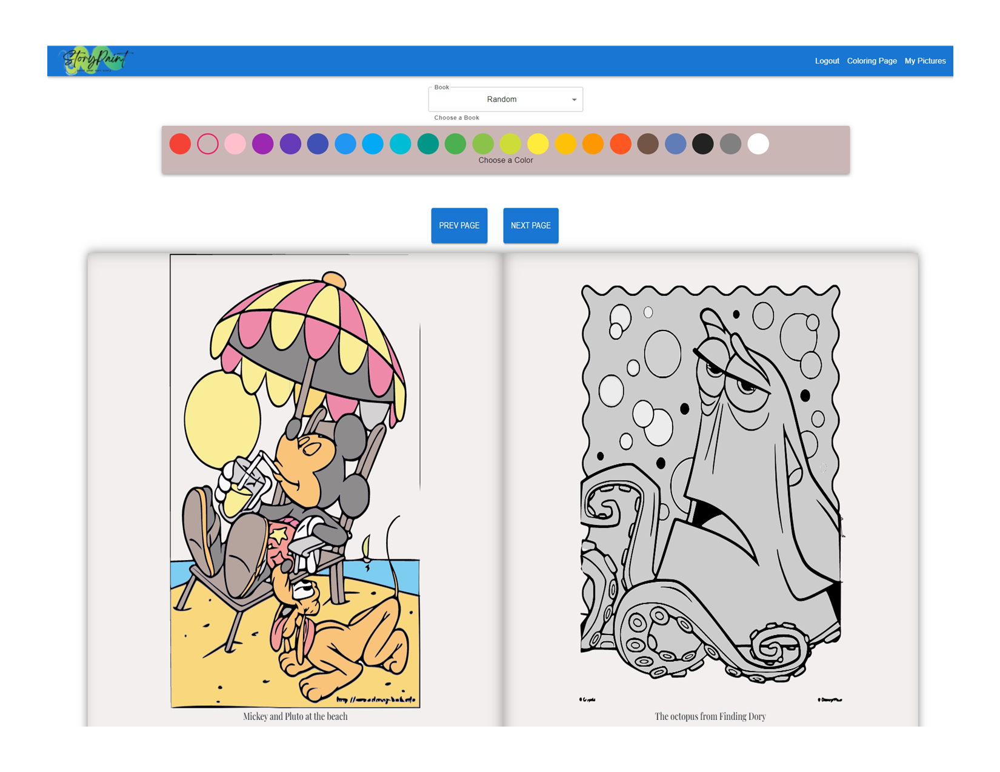

<div id="top"></div>
<!--
*** Thanks for checking out the Best-README-Template. If you have a suggestion
*** that would make this better, please fork the repo and create a pull request
*** or simply open an issue with the tag "enhancement".
*** Don't forget to give the project a star!
*** Thanks again! Now go create something AMAZING! :D
-->


<!-- PROJECT SHIELDS -->
<!--
*** I'm using markdown "reference style" links for readability.
*** Reference links are enclosed in brackets [ ] instead of parentheses ( ).
*** See the bottom of this document for the declaration of the reference variables
*** for contributors-url, forks-url, etc. This is an optional, concise syntax you may use.
*** https://www.markdownguide.org/basic-syntax/#reference-style-links
-->
[![Contributors][contributors-shield]][contributors-url]
[![Forks][forks-shield]][forks-url]
[![Stargazers][stars-shield]][stars-url]
[![Issues][issues-shield]][issues-url]
[![LinkedIn][linkedin-shield]][linkedin-url]


<!-- PROJECT LOGO -->
<br />
<div align="center">
  <a href="https://github.com/Wsanders81/StoryPaint-Frontend">
    
  </a>

  <p align="center">
    StoryPaint is a coloring book application.
    <br />
    <a href="https://github.com/Wsanders81/StoryPaint-Frontend"><strong>Explore the docs »</strong></a>
    <br />
    <br />
    <a href="https://storypaint.surge.sh/">View Demo</a>
    ·
    <a href="https://github.com/Wsanders81/StoryPaint-Frontend/issues">Report Bug</a>
    ·
    <a href="https://github.com/Wsanders81/StoryPaint-Frontend/issues">Request Feature</a>
  </p>
</div>


<!-- TABLE OF CONTENTS -->
<details>
  <summary>Table of Contents</summary>
  <ol>
    <li>
      <a href="#about-the-project">About The Project</a>
      <ul>
        <li><a href="#built-with">Built With</a></li>
      </ul>
    </li>
    <li>
      <a href="#getting-started">Getting Started</a>
      <ul>
        <li><a href="#prerequisites">Prerequisites</a></li>
        <li><a href="#installation">Installation</a></li>
      </ul>
    </li>
    <li><a href="#usage">Usage</a></li>
    <li><a href="#roadmap">Roadmap</a></li>
    <li><a href="#contributing">Contributing</a></li>
    <li><a href="#license">License</a></li>
    <li><a href="#contact">Contact</a></li>
    <li><a href="#acknowledgments">Acknowledgments</a></li>
  </ol>
</details>

<!-- ABOUT THE PROJECT -->
## About The Project


<p align="right">(<a href="#top">back to top</a>)</p>


### Built With

  #### Front End
* [React.js](https://reactjs.org/)
* [Material.Ui](https://mui.com/)
* [Bootstrap](https://getbootstrap.com)
* [JQuery](https://jquery.com)
#### Back End
* [Node.js](https://nodejs.org/)
* [Express.js](https://expressjs.com/)
* [Node-postgres](https://node-postgres.com/)


<p align="right">(<a href="#top">back to top</a>)</p>


<!-- GETTING STARTED -->
## Getting Started

This is an example of how you may give instructions on setting up your project locally.
To get a local copy up and running follow these simple example steps.

### Prerequisites

This is an example of how to list things you need to use the software and how to install them.
* npm
  ```sh
  npm install npm@latest -g
  ```

### Installation

1. Clone the frontend repo
  
   ```sh
   git clone https://github.com/jquatjr/StoryPaint-Frontend
   ```
2. Clone the backend repo
3. ```sh
   git clone https://github.com/jquatjr/StoryPaint
   ```
4. Install NPM packages in both frontend and backend folder
   ```sh
   cd [frontend_folder]
   npm install
   cd [backend_folder]
   npm install
   ```
5. Start up server and backend separately
   ```sh
   cd [backend_folder]
   node server.js
   cd [frontend_folder]
   npm start
   ```

<p align="right">(<a href="#top">back to top</a>)</p>


<!-- USAGE EXAMPLES -->
## Usage


### Examples:




<div>


</div>


_For more examples, please refer to the [Documentation](https://example.com)_

<p align="right">(<a href="#top">back to top</a>)</p>

<!-- CONTRIBUTING -->
## Contributing

Contributions are what make the open source community such an amazing place to learn, inspire, and create. Any contributions you make are **greatly appreciated**.

If you have a suggestion that would make this better, please fork the repo and create a pull request. You can also simply open an issue with the tag "enhancement".
Don't forget to give the project a star! Thanks again!

1. Fork the Project
2. Create your Feature Branch (`git checkout -b feature/AmazingFeature`)
3. Commit your Changes (`git commit -m 'Add some AmazingFeature'`)
4. Push to the Branch (`git push origin feature/AmazingFeature`)
5. Open a Pull Request

<p align="right">(<a href="#top">back to top</a>)</p>


<!-- LICENSE -->


<!-- CONTACT -->
## Contact

William Sanders - [Portfolio site](https://www.willsanders.dev) - williamsanders81@gmail.com

Project Link ( Frontend ): [https://github.com/Williamsanders81/StoryPaint-Frontend](https://github.com/Williamsanders81/StoryPaint-Frontend)

Project Link ( Backend ): [https://github.com/Williamsanders81/StoryPaint](https://github.com/Williamsanders81/StoryPaint)

<p align="right">(<a href="#top">back to top</a>)</p>


<!-- ACKNOWLEDGMENTS -->
## Acknowledgments

* [Matthew Dillon](https://www.linkedin.com/in/coderdill/)
* [John Quattrocchi](https://www.linkedin.com/in/jquatjr/)

<p align="right">(<a href="#top">back to top</a>)</p>


<!-- MARKDOWN LINKS & IMAGES -->
<!-- https://www.markdownguide.org/basic-syntax/#reference-style-links -->
[contributors-shield]: https://img.shields.io/github/contributors/Wsanders81/StoryPaint-Frontend.svg?style=for-the-badge
[contributors-url]: https://github.com/Wsanders81/StoryPaint-Frontend/graphs/contributors
[forks-shield]: https://img.shields.io/github/forks/Wsanders81/StoryPaint-Frontend.svg?style=for-the-badge
[forks-url]: https://github.com/Wsanders81/StoryPaint-Frontend/network/members
[stars-shield]: https://img.shields.io/github/stars/Wsanders81/StoryPaint-Frontend.svg?style=for-the-badge
[stars-url]: https://github.com/Wsanders81/StoryPaint-Frontend/stargazerss
[issues-shield]: https://img.shields.io/github/issues/Wsanders81/StoryPaint-Frontend.svg?style=for-the-badge
[issues-url]: https://github.com/Wsanders81/StoryPaint-Frontend/issues
[license-shield]: https://img.shields.io/github/license/Wsanders81/StoryPaint-Frontend.svg?style=for-the-badge
[license-url]: https://github.com/Wsanders81/StoryPaint-Frontend/blob/master/LICENSE.txt
[linkedin-shield]: https://img.shields.io/badge/-LinkedIn-black.svg?style=for-the-badge&logo=linkedin&colorB=555
[linkedin-url]: https://linkedin.com/in/williamsanders81/
[product-screenshot]: images/screenshot.png
